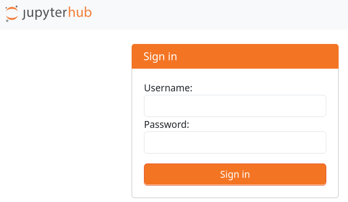
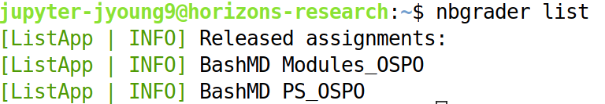
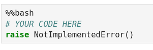
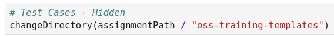
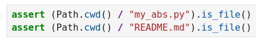
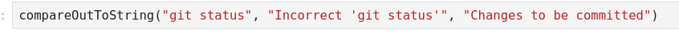
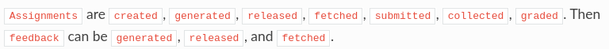
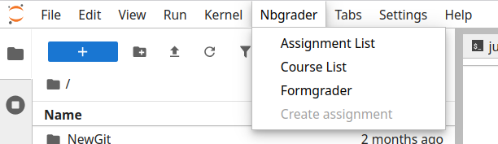
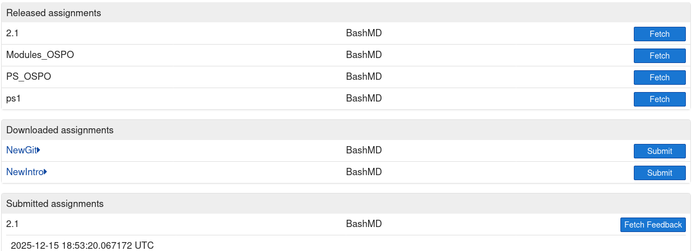

# Student Workflow

## Purpose
Nbgrader + JupyterHub @ GT OSPO gives students the ability to test their basic knowledge on git, pytest (unit testing), licensing etc. prior to starting work on an open source project. JupyterHub provides the JupyterLab interface for students to read instructional material and complete corresponding problem sets. As an extension of JupyterHub, Nbgrader distributes and grades Jupyter notebooks.

Please feel free to report issues with this content by filing an issue on this repository. 

---

## Primary Workflow

The following sections detail typical student usage of the nbgrader framework. 

To get into your JupyterHub account, you should visit the login screen at [horizons-research.cc.gatech.edu](https://horizons-research.cc.gatech.edu). Login with your assgined username. 
- *For First-time Users* (Most Likely Scenario): Input the desired password; this will become your future password.

Once you login, open a new terminal instance in the main panel.

Run `nbgrader list` to show all released assignments. These include assignments `Modules_OSPO` and `PS_OSPO`, both from a course called `BashMD`. To retrieve these assignments run the following from your home (`~`) directory:
- `nbgrader fetch_assignment Modules_OSPO --course BashMD -f`
- `nbgrader fetch_assignment PS_OSPO --course BashMD -f`

The `Modules_OSPO` folder primarily contains lesson content; it is recommended that students at least skim through all notebooks sequentially. Notebooks L01 and L03 contain ***completely optional*** interactive portions; these may give a good idea of what will be tested by the autograder since all test cases are given. While there are points allotted to some sections of L01 and L03, do not submit `Modules_OSPO` as it is for students' reference. Additionally, do not worry about passing all the test cases in `Modules_OSPO`, as some checks may be out of date.

Students put their answers in `autograded answer` cells, usually marked by (multiple) `raise NotImplementedError()` exceptions. In released solutions, these cells will contain a valid *reference* answer.

Complete the notebooks labeled `PS01`, `PS03`, `PS04`, and `PS08` in the `PS_OSPO` folder. Nbgrader runs the entire notebook from start to finish and gives points to `autograded tests` cells (see examples above), usually marked by `# Test Cases - Hidden` or `# Test Cases` (*Note*: Some cells may appear completely empty, though this is unintended. Please do not delete such cells!). These cells pass so long as the test case runs without throwing errors. Do *not* modify the contents in `autograded tests` or the case will automatically fail integrity checks upon grading. It should be noted that each `autograded test` cell is graded on an all-or-nothing basis, regardless of the number of points assigned to it. All test cases are visible in the `Modules_OSPO` notebooks. Only some test cases are visible in `PS_OSPO` notebooks. 

For submitting and receiving feedback, students can utilize either the Nbgrader UI or a set of command line options. Both of these are described in the `GUI` and `CLI` sections. The whole workflow encompasses the following:

1. List all available assignments (above)
1. Fetch the assignment (above)
1. Complete the assignment by filling in unimplemented sections
1. Validate the assignment
1. Submit the assignment
1. *Manually* fetch feedback from the assignment once graded

It is recommended to follow the `GUI` from step 4 onwards. The terminal primarily serves as backup and allows for the manual removal of assignments (folders).

### Additional Information
Students can view their most recent grades inside of each individual notebook inside returned feedback or in the `Assignment List` tab.

During the duration of onboarding, there will be a background process that scores and returns feedback on the most recent submission of `PS_OSPO`. In the output of each test case, expect a brief non-specific one-liner detailing the problem if one exists. This process runs every 5 to 15 minutes.

Calling `fetch_assignment` on an already downloaded assignment will throw an error. Either use the `-f` parameter or remove the assignment folder using `rm -r ASSIGNMENTNAME` and refetch using `nbgrader fetch_assignment ASSIGNMENT_NAME --course COURSE_NAME`. In general, not using `-f` will throw an error if overwriting existing files or folders.

---

## GUI

The complete assignment workflow for students is listed below for the assignment `Modules_OSPO` in the course `BashMD`.

1. Go to the title bar and look for the `Assignment List`* submenu in the `Nbgrader` menu. 

1. Ensure that the upper bar has `BashMD` selected, then fetch the `Modules_OSPO` assignment if not in `Downloaded assignments`.
1. Complete the assignment in each notebook.

3. Validate the assignment. Additionally, check that no cell hangs for more than 30 seconds (See kernel status, this is the default kernel timeout).
4. Submit and fetch feedback in the `Assignment List` UI. Eash submission should create a new entry under `Submitted assignments`.

Repeat these steps with `PS_OSPO` in course `BashMD`.

## CLI

The complete assignment workflow for students is listed below for the assignment `Modules_OSPO` in the course `BashMD`. Run the following:

1. `cd ~`: Go to home directory 
1. `nbgrader list`: List all available assignments
1. `nbgrader fetch_assignment Modules_OSPO --course BashMD -f`: Fetches course content into current directory, `-f` flag mandatory if course already pulled
1. Validate the assignment by running `nbgrader validate NOTEBOOKDIR/*` on the ***all*** notebooks in the directory
1. `nbgrader submit Modules_OSPO --course BashMD`: Submits read-only copy to instructor
1. `nbgrader fetch_feedback Modules_OSPO --course BashMD`: Retrieves most recent autograder feedback, if it exists

Note: It is not recommended for students to use the Python API as this adds an unnecessary layer of complexity with few benefits.

## Extra Documentation
General Nbgrader documentation can be found [here](https://nbgrader.readthedocs.io/en/stable/configuration/jupyterhub_config.html).

> Note: `Assignment List` only works when one course is available (this should always be `BashMD`)
